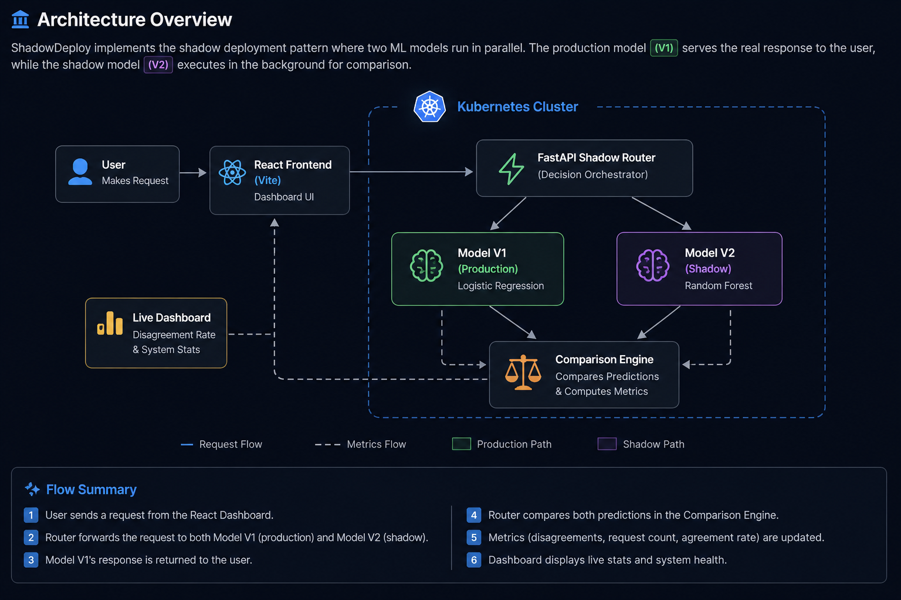
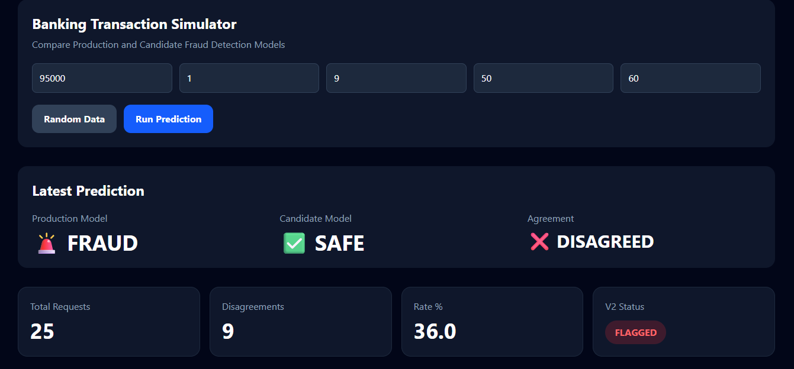

<h1 align="center">🚀 ShadowDeploy</h1>

<p align="center">
Production-Style Machine Learning Shadow Deployment Platform
</p>


<p align="center">


</p>

ShadowDeploy is a cloud-native machine learning deployment platform that safely evaluates candidate ML models in production using **Shadow Deployment**.

Every incoming request is processed by both the production model and the candidate model simultaneously. The production model serves the user while the candidate model runs silently in the background. Their predictions are compared in real time, allowing safe model validation before deployment.

---

## 🌐 Live Demo

* **🚀 Frontend:** https://shadowdeploy-frontend.onrender.com
* **📘 API Documentation:** https://shadowdeploy-router.onrender.com/docs


---
## 💡 Why Shadow Deployment?

Traditional model deployment replaces the production model immediately, introducing the risk of unexpected failures. Shadow Deployment eliminates this risk by executing a candidate model alongside the production model on the same requests while only exposing the production model's predictions to end users.

ShadowDeploy demonstrates this industry-adopted deployment strategy by safely evaluating model performance through real-time prediction comparison, disagreement monitoring, and production-style traffic routing.
---
## ✨ Features

* Production-style Shadow Deployment
* Dual ML Models (Production + Candidate)
* Real-time Prediction Comparison
* Live Disagreement Rate Monitoring
* Interactive React Dashboard
* FastAPI Microservices Architecture
* Dockerized Services
* Kubernetes Deployments & Services
* Horizontal Scaling
* Rolling Updates
* Cloud Deployment on Render

---

## 🛠 Tech Stack

| Category         | Technologies                                     |
| ---------------- | ------------------------------------------------ |
| Frontend         | React, Tailwind CSS, Axios, Recharts             |
| Backend          | FastAPI, Python                                  |
| Machine Learning | Scikit-learn, Logistic Regression, Random Forest |
| DevOps           | Docker, Kubernetes, Docker Hub                   |
| Cloud            | Render                                           |
| Version Control  | Git, GitHub                                      |

---

## 🏗 System Architecture

<p align="center">

</p>

---

## 📂 Project Structure

```text
ShadowDeploy
│
├── assets/
├── frontend/
├── router/
├── model-v1/
├── model-v2/
├── k8s/
├── wheels/
├── docker-compose.yml
└── README.md
```

---

## ⚙️ How It Works

1. User submits transaction details from the React dashboard.
2. The FastAPI Router receives the request.
3. The Router sends the same request to both ML models.
4. The Production Model response is returned to the user.
5. The Candidate Model prediction is stored for comparison.
6. ShadowDeploy measures disagreement rate and updates live statistics.
7. The dashboard visualizes request count, disagreement rate, and model health in real time.

---

## ☁️ Deployment

All services are independently containerized and deployed.

* React Frontend → Render
* FastAPI Router → Render
* Production ML Model → Render
* Candidate ML Model → Render
* Docker Images → Docker Hub
* Kubernetes Deployments → Local Cluster

---
## 📈 Deployment Architecture

```text
                User
                  │
                  ▼
      React Frontend (Render)
                  │
                  ▼
      FastAPI Shadow Router
          │               │
          ▼               ▼
 Production Model     Shadow Model
(Logistic Regression) (Random Forest)
          │               │
          └──── Comparison ────┘
                  │
                  ▼
        Live Dashboard & Statistics
```
## 📸 Dashboard 

<p align="center">
  
</p>

The dashboard provides real-time prediction results, model comparison, disagreement monitoring, and system health, allowing users to visualize how the production and shadow models behave under identical requests.
---
## 🚀 Future Improvements

* Authentication & API Keys
* Prometheus + Grafana Monitoring
* Horizontal Pod Autoscaler (HPA)
* CI/CD with GitHub Actions
* Persistent Database for Analytics
* Canary Deployment Support
* Model Version Management

---
## 🎓 Key Learnings

Building ShadowDeploy provided hands-on experience with production-oriented machine learning deployment concepts, including:

* Designing microservice-based ML systems
* Implementing Shadow Deployment strategies
* Containerizing applications using Docker
* Orchestrating services with Kubernetes
* Deploying distributed services to the cloud using Render
* Building REST APIs with FastAPI
* Developing interactive dashboards using React
* Managing end-to-end application deployment with Git and GitHub
---
## 📜 License

This project is licensed under the MIT License.
